# Axisymmetric Nozzle Portfolio

This repository is a portfolio-ready OpenFOAM case for a compressible axisymmetric nozzle with a freestream domain, shock-capable solver, and thrust coefficient post-processing.

The work here was built in stages:

1. define the axisymmetric nozzle and freestream domain,
2. build and validate the mesh,
3. wire up a compressible density-based solver,
4. add a thrust balance that uses the CFD solution directly,
5. generate Mach contour plots and convergence plots,
6. sweep nozzle pressure ratio cases and archive each run separately.

## What This Case Represents

The nozzle is modeled as a 2D axisymmetric-style domain with:

- a straight internal nozzle section,
- a convergent section near the exit,
- a freestream inlet on the left,
- a freestream outlet on the right,
- a slip boundary on the top,
- the axis of rotation along the bottom.

The original reference layout used during development was:

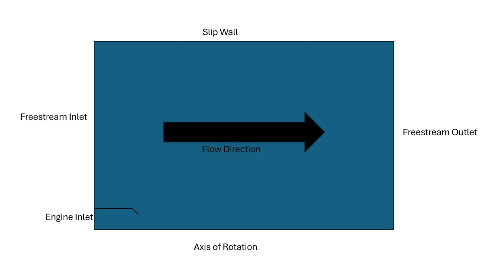

The actual validated mesh is:

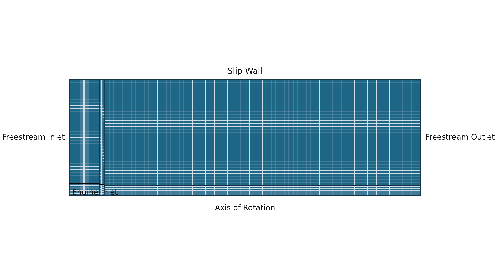

## Current Geometry

The current mesh is defined directly in [`case/system/blockMeshDict`](case/system/blockMeshDict).

Key dimensions:

- nozzle radius: `4 in`
- axial nozzle length: `12 in`
- convergent area reduction: `20%` over the last `2 in`
- freestream box: `10x` nozzle length by `10x` nozzle radius initially
- then doubled twice to reduce outer-boundary reflections

Final outer domain used for the sweep runs:

- axial extent: `480 in`
- radial extent: `160 in`

The mesh is still the same coarse structured baseline used to get the solver working. We intentionally kept it coarse enough to converge the flow setup and thrust accounting before refining further.

Mesh properties:

- `blockMesh` passes
- `checkMesh` passes
- no prism/inflation layers yet
- wall-normal grading is present in the internal nozzle blocks

## Solver Setup

The case uses the OpenFOAM 13 density-based compressible solver path:

- solver: `shockFluid`
- source of run configuration: [`case/system/controlDict`](case/system/controlDict)

The solver setup is intended to capture:

- compressibility,
- shocks,
- nozzle expansion,
- plume development into the freestream box.

Boundary conditions on the baseline case:

- freestream inlet:
  - Mach `0.05`
  - pressure `14.7 psia`
  - temperature `518.7 R`
- freestream outlet:
  - pressure `14.7 psia`
  - reverse-flow-safe velocity handling
- engine inlet:
  - total pressure ratio `PR = 2.0` for the baseline
  - total temperature `1500 R`

The working initial fields in [`case/0`](case/0) are the clean template version for new runs. The archived runs live separately under `cases/`.

## Thrust Coefficient Definition

The portfolio metric is:

```text
Cfg = T_CFD / T_ideal
```

The implementation is in:

- [`case/system/thrustBalance`](case/system/thrustBalance)
- [`case/system/functions`](case/system/functions)

### `T_CFD`

`T_CFD` is built from a control-volume balance over the nozzle interior:

- inlet momentum flux,
- inlet pressure force,
- internal nozzle wall pressure force,
- internal nozzle wall shear force.

Important details:

- only the internal nozzle wall is counted in the CFD force balance,
- pressure forces use gauge pressure, not absolute pressure,
- the force convention is rightward positive,
- the balance is reported as a 360-degree equivalent.

The thrust balance is written at every solver write time into:

- `postProcessing/.../thrustBalance/data`

### `T_ideal`

`T_ideal` is the ideal expansion reference thrust for the same inlet conditions and the same CFD mass-flow convention.

The chain used in the code is:

1. pressure ratio `PR -> M_ideal`
2. `M_ideal -> T0/T`
3. `T0/T -> T_s,ideal`
4. `T_s,ideal -> a_ideal`
5. `a_ideal -> U_ideal`
6. `T_ideal = mdot * U_ideal`

For this portfolio case we assume ideal expansion, so `p_e = p_amb` and there is no separate pressure-thrust term in the ideal reference.

## Post-Processing

Mach number is written automatically through the solver function objects and also rendered after each completed run.

The plotting scripts are:

- [`scripts/render_mach.py`](scripts/render_mach.py)
- [`scripts/plot_thrust_convergence.py`](scripts/plot_thrust_convergence.py)
- [`scripts/run_pr_sweep.py`](scripts/run_pr_sweep.py)

The Mach renderer now writes two images for each run:

- full domain view,
- bottom-left zoom view.

The thrust plotter writes the convergence history for each run, and the sweep driver labels the outputs with the NPR value.

## Baseline PR2.0 Run

The PR2.0 baseline run was the reference point for the rest of the study.

Archived outputs:

- [`cases/PR2.0/case`](cases/PR2.0/case)
- [`cases/PR2.0/images`](cases/PR2.0/images)

Mach plots:

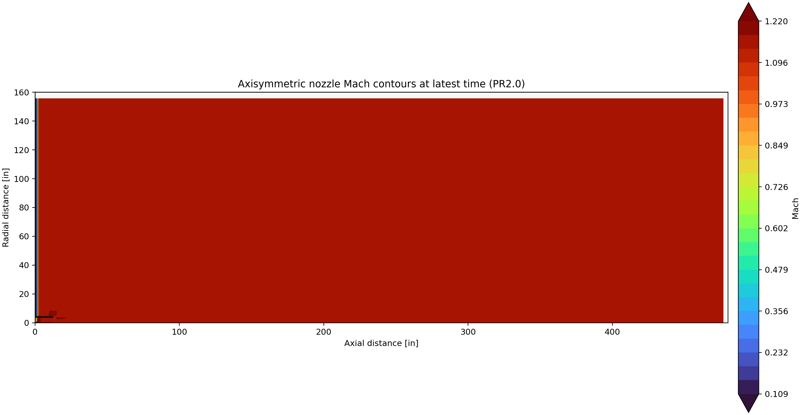

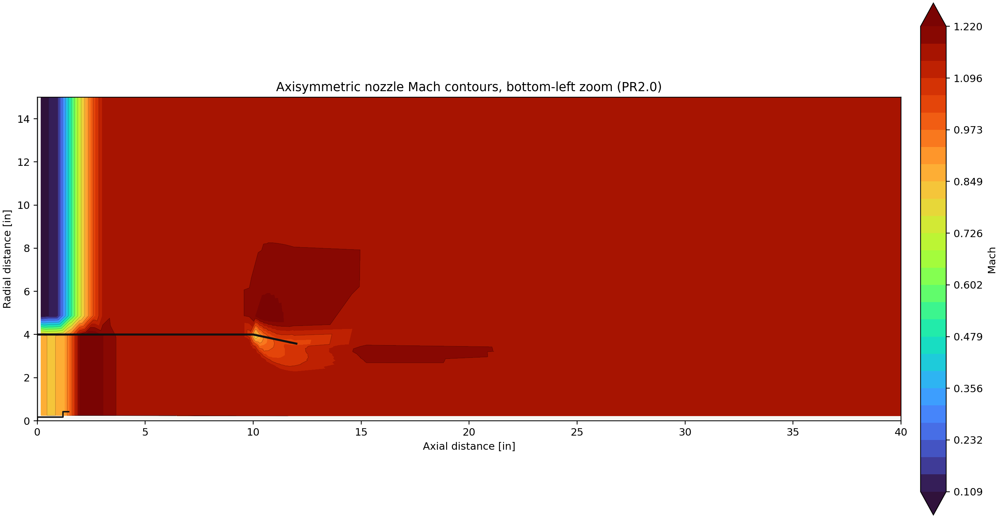

For the baseline case, the useful takeaway was that the flow field could be marched cleanly to the target end time and the Mach field could be post-processed directly from the solved state.

## NPR Sweep Results

The NPR sweep cases are stored independently under:

- `cases/PR1.5`
- `cases/PR1.8`
- `cases/PR2.2`
- `cases/PR3.0`

Each archive contains:

- `case/` - the full cloned OpenFOAM case used for that NPR point,
- `data/` - the thrust balance CSV,
- `images/` - the Mach contours and thrust convergence plot,
- `logs/` - the solver log.

### PR1.5

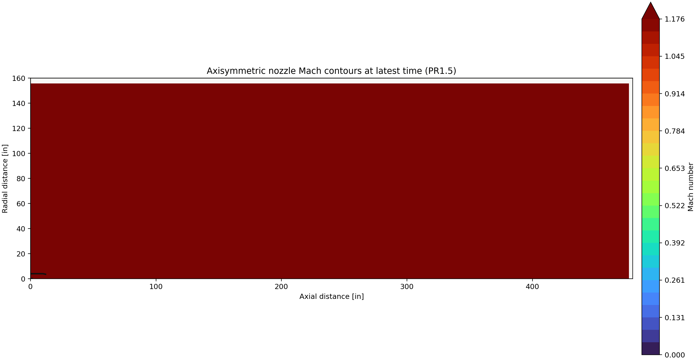

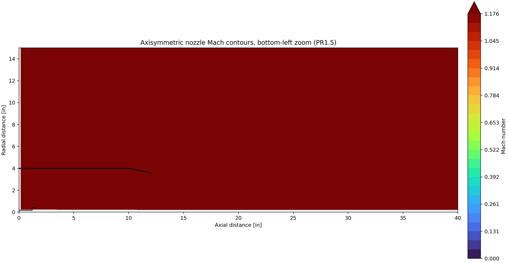

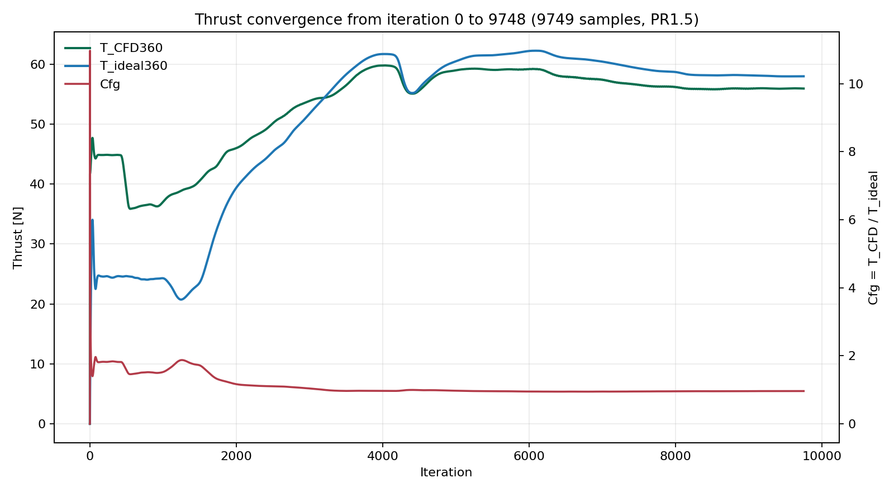

### PR1.8


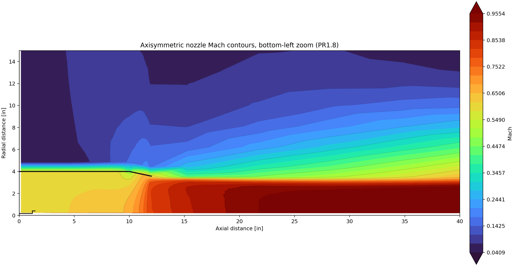

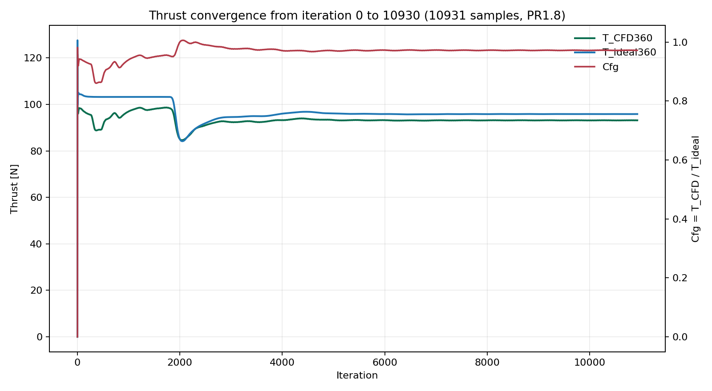

### PR2.2


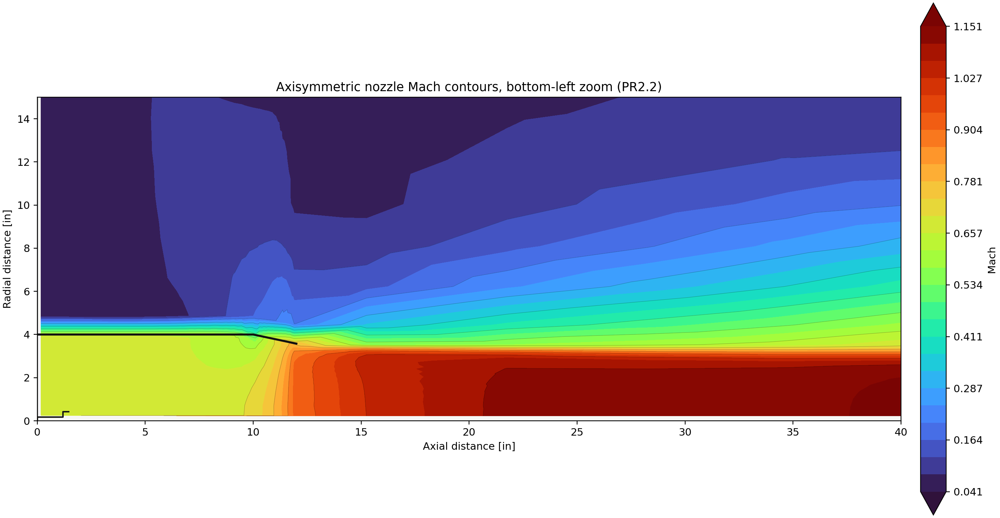

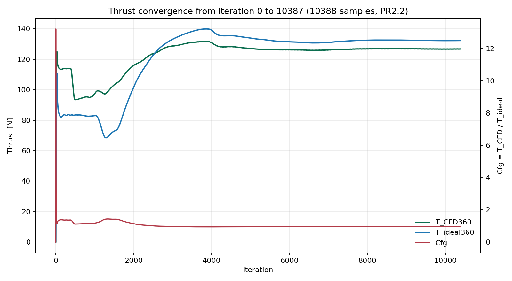

### PR3.0


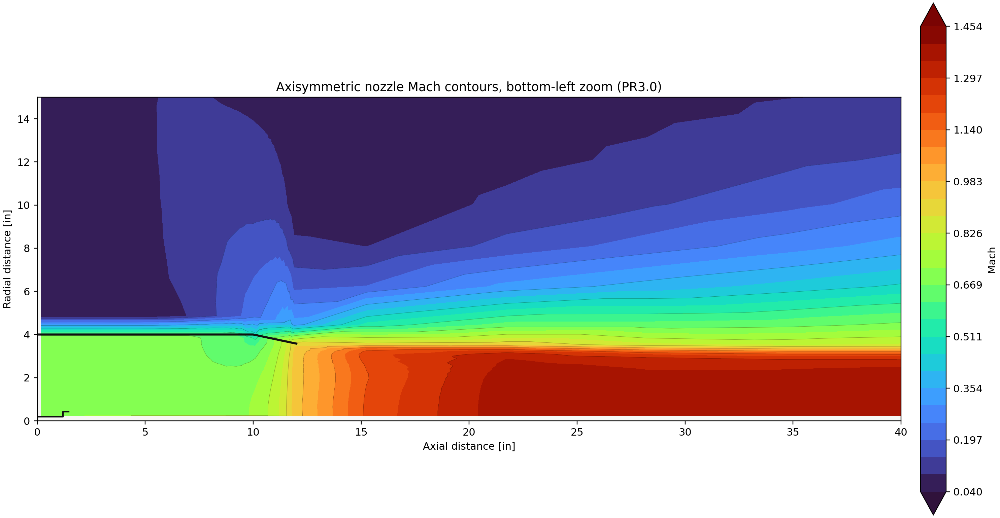

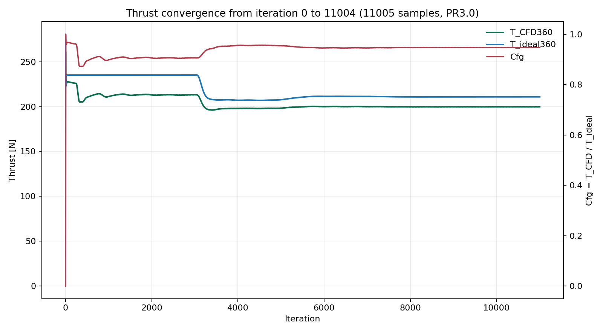

### Cfg vs NPR

The final sweep comparison uses the average `Cfg` over the last 10% of samples in each run:

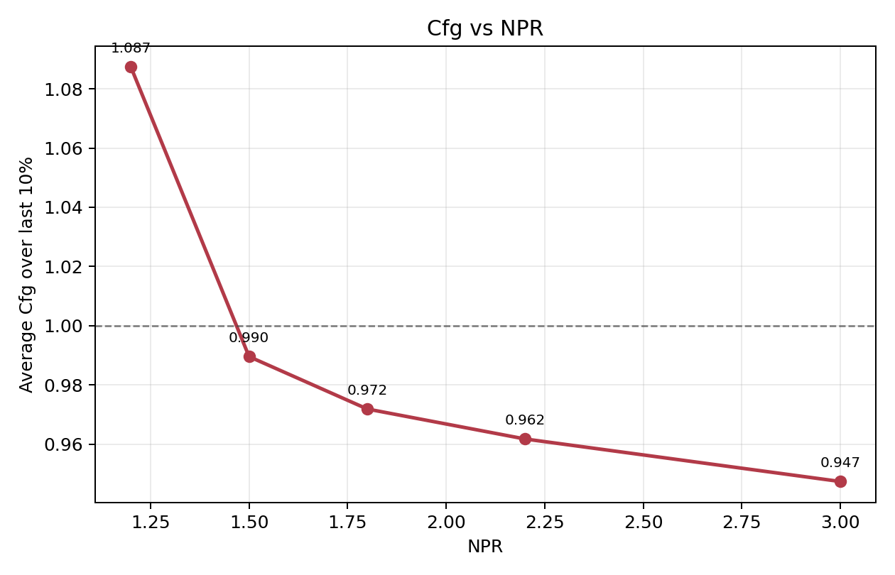

Summary data:

- [`cases/summary/cfg_vs_npr_summary.csv`](cases/summary/cfg_vs_npr_summary.csv)

Observed averaged `Cfg` values:

- `PR1.5`: `0.963637`
- `PR1.8`: `0.960421`
- `PR2.2`: `0.958172`
- `PR3.0`: `0.946950`

The trend is the useful portfolio result:

- low NPR is still the least well-behaved point,
- the higher NPR cases settle below 1,
- the coefficient decreases gradually as NPR rises.

### Why `Cfg` Decreases With NPR

That downward trend is expected for a purely convergent nozzle once the flow is at or above the critical pressure ratio.

The short version is:

- below the critical NPR, the nozzle is unchoked and the exhaust velocity can still respond strongly to higher stagnation pressure,
- at and above the critical NPR, the minimum-area section chokes and the exit Mach is pinned near sonic,
- further increases in NPR cannot be turned into proportionally higher nozzle exit velocity inside the convergent geometry.

In this case that means:

- `T_CFD` begins to saturate because the nozzle has reached its sonic limit,
- `T_ideal` continues to rise because the ideal reference still assumes the extra stagnation pressure can be converted into ideal exhaust velocity,
- the ratio `Cfg = T_CFD / T_ideal` therefore drifts downward as NPR increases.

This is why the sweep is still useful even though the nozzle is simple:

- it shows the transition from unchoked to choked behavior,
- it highlights the limit of a purely convergent nozzle,
- and it provides a clean baseline for later comparison against a convergent-divergent design.

## Run Organization

The repository now keeps the active template separate from the archived runs.

### Template Case

The working case in [`case/`](case/) is the reusable template that gets cloned for each NPR point.

It contains:

- `0/`
- `constant/`
- `system/`
- `Allrun`
- `Allclean`

### Archived Runs

Each NPR gets its own fully isolated archive under `cases/PRx.x/case`.

That means each sweep point keeps:

- its own input files,
- its own time directories,
- its own logs,
- its own post-processing,
- its own generated plots.

This is what keeps the sweep clean and reproducible.

## Reproducibility Notes

The main scripts are designed so the archived NPR runs can be reproduced later without guessing which state was used:

- [`scripts/run_pr_sweep.py`](scripts/run_pr_sweep.py)
  - clones the template case,
  - patches the NPR-specific inlet pressure,
  - runs `blockMesh`,
  - runs `shockFluid`,
  - copies the resulting files into `cases/PRx.x/`.
- [`scripts/render_mach.py`](scripts/render_mach.py)
  - renders the full-domain Mach contour,
  - renders the bottom-left zoom,
  - labels outputs with the NPR value.
- [`scripts/plot_thrust_convergence.py`](scripts/plot_thrust_convergence.py)
  - plots `T_CFD360`, `T_ideal360`, and `Cfg`,
  - labels the output with the NPR value.

## Notes and Assumptions

- The current mesh is intentionally a first-pass mesh, not a final refined mesh.
- The thrust balance is built to be physically sign-consistent and 360-equivalent.
- The ideal-thrust model assumes ideal expansion.
- The wall shear contribution is tracked, but the force balance is still dominated by pressure and inlet momentum.
- Future refinement work should focus on near-wall resolution and later on the outer freestream domain if needed.

## Directory Snapshot

```text
case/
  0/
  constant/
  system/
  Allrun
  Allclean

cases/
  PR1.2/
  PR1.5/
  PR1.8/
  PR2.0/
  PR2.2/
  PR3.0/
  summary/

geometry/
images/
scripts/
```

## What To Look At First

If you are trying to understand the project quickly, start with:

1. [`images/axi_nozzle_domain.jpg`](images/axi_nozzle_domain.jpg)
2. [`images/axi_nozzle_mesh.png`](images/axi_nozzle_mesh.png)
3. [`cases/summary/cfg_vs_npr.png`](cases/summary/cfg_vs_npr.png)
4. one of the NPR run folders, for example [`cases/PR2.2`](cases/PR2.2)
